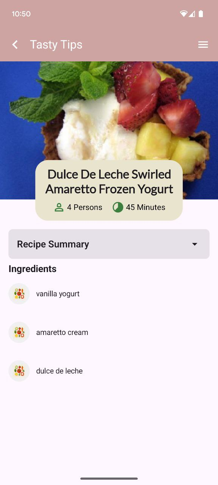

A mobile application for discovering and viewing popular recipes, developed in Kotlin using modern Android tools. The project was implemented as part of a test assignment and demonstrates proficiency in architecture design, API integration, and offline functionality.

Key Features:

    • Display of popular recipes (Random Recipes from the Spoonacular API)
    • Detailed information for each recipe (photo, description, ingredients, etc.)
    • Recipe search by name
    • Pagination in the recipe list
    • Offline mode with caching support
    • Navigation between screens with state preservation

Technologies Used:

    • Kotlin – primary development language
    • Jetpack Compose
    • MVVM + Clean Architecture
    • Hilt – dependency injection
    • Retrofit – network communication
    • Room – local database
    • Coroutines + Flow – asynchronous programming and state management
    • Coil – image loading
    • Navigation Compose – navigation between screens
    

  
  

